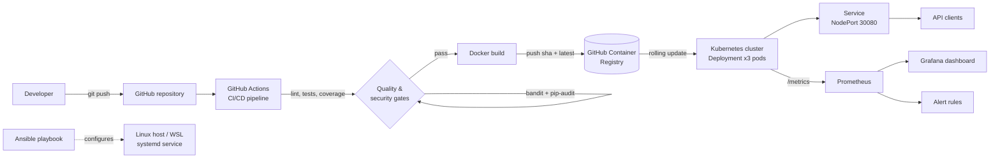
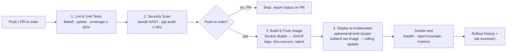

# DevOps Case Study – FinVeritas Ratio Service (CA-II)

[](https://github.com/AnshulMandekar/AnshulMandekar-devops-case-study-main/actions/workflows/ci-cd.yml)

Hands-on DevOps implementation for the CA-II case-study evaluation. The service is taken from my B.Tech PBL project
**FinVeritas** – an explainable financial background-check system – whose financial-ratio engine (liquidity,
solvency and debt-service checks) is extracted into an independent microservice and then built, tested,
secured, deployed, configured and monitored with a complete DevOps toolchain.

| Task | What is delivered | Where |
|---|---|---|
| Case studies | Netflix (Q1) and Amazon (Q2) analysis with diagrams | [`docs/CA2_DevOps_Case_Studies.docx`](docs/CA2_DevOps_Case_Studies.docx) |
| 1 – Deployment strategy | GitHub Actions pipeline: test → security scan → build & push → deploy to Kubernetes | [`.github/workflows/ci-cd.yml`](.github/workflows/ci-cd.yml), [pipeline diagram](#task-1--deployment-strategy-github-actions) |
| 2 – Configuration management | Ansible playbook + inventory (packages, users, files, systemd service) | [`ansible/`](ansible) |
| 3 – Containerization & orchestration | Dockerfile, Kubernetes Deployment/Service, rolling update & rollback | [`Dockerfile`](Dockerfile), [`k8s/`](k8s), [`scripts/rolling-update-demo.sh`](scripts/rolling-update-demo.sh) |
| 4 – Monitoring & logging | Prometheus + Grafana, app metrics, dashboard (uptime, latency, error rate), alerts | [`monitoring/`](monitoring), [`docker-compose.yml`](docker-compose.yml) |
| 5 – Reflection & report | Architecture, pipeline flow, challenges, lessons learned | [this README](#task-5--reflection) |

## Case study answers (summary)

The full answers, with diagrams and tables, are in [`docs/CA2_DevOps_Case_Studies.docx`](docs/CA2_DevOps_Case_Studies.docx).

| Question | Problem | DevOps solution | Outcome |
|---|---|---|---|
| **Q1 – Netflix** | 2008 database corruption stopped DVD shipments for 3 days: a single vertically scaled database, tightly coupled monolith, slow recovery and risky releases | Cloud-native microservices on AWS (database per service, multi-region, circuit breakers), "you build it, you run it", Spinnaker continuous delivery and **Chaos Engineering** (Chaos Monkey, Simian Army, Chaos Kong) | Failures isolated to one service, elastic global scaling, resilience continuously tested in production |
| **Q2 – Amazon** | Monolith ("Obidos") caused frequent site-wide outages and slow, coordinated releases | Service-oriented / microservices architecture behind APIs, **two-pizza teams** owning services end-to-end, automated deployment pipelines with rollback | Independent deployments – on average one every ~11.7 seconds – and a culture of continuous experimentation |

---

## Architecture



**Tech stack**

| Layer | Tool |
|---|---|
| Application | Python 3.12, Flask, Gunicorn |
| Testing & quality | pytest, pytest-cov (85% gate), flake8 |
| Security scanning | bandit (SAST), pip-audit (dependency CVEs), non-root container, read-only filesystem |
| CI/CD | GitHub Actions, GitHub Container Registry (GHCR) |
| Containers & orchestration | Docker, Kubernetes (kind / Docker Desktop) |
| Configuration management | Ansible |
| Monitoring | Prometheus, Grafana, prometheus-flask-exporter, kube-prometheus-stack |

## Repository structure

```
.
├── .github/workflows/ci-cd.yml        # Task 1 – CI/CD pipeline
├── app/
│   ├── main.py                        # Flask API, Prometheus metrics, chaos switches
│   └── ratios.py                      # FinVeritas financial-ratio checks (business logic)
├── tests/                             # Unit + API tests (pytest)
├── Dockerfile                         # Task 3 – container image
├── docker-compose.yml                 # Task 4 – local API + Prometheus + Grafana stack
├── ansible/
│   ├── inventory.ini                  # Task 2 – inventory
│   ├── playbook.yml                   # Task 2 – configuration playbook
│   └── templates/                     # systemd unit, env file, logrotate config
├── k8s/
│   ├── namespace.yaml
│   ├── configmap.yaml                 # runtime config (chaos switches)
│   ├── deployment.yaml                # Task 3 – Deployment (rolling update strategy)
│   └── service.yaml                   # Task 3 – Service (NodePort)
├── monitoring/
│   ├── kube-prometheus-values.yaml    # Helm values for Prometheus + Grafana
│   ├── servicemonitor.yaml            # scrape config for the service
│   ├── prometheus-rules.yaml          # alerting rules (down, error rate, latency)
│   ├── grafana-dashboard.json         # dashboard (uptime, latency, error rate …)
│   ├── grafana-dashboard-configmap.yaml
│   ├── prometheus.yml                 # scrape config for docker-compose
│   └── grafana/provisioning/          # Grafana datasource + dashboard provisioning
├── scripts/
│   ├── kind-config.yaml               # local Kubernetes cluster with port mappings
│   ├── rolling-update-demo.sh         # v1 → v2 rolling update → rollback
│   ├── setup-monitoring.sh            # installs the monitoring stack
│   └── load-test.sh                   # generates traffic for the dashboard
└── docs/
    ├── CA2_DevOps_Case_Studies.docx   # case-study answers (Q1 and Q2)
    └── screenshots/                   # evidence for Tasks 3 and 4
```

## The service

`finveritas-ratio-service` evaluates a company's financial health. Each check returns the value, the formula
and a **PASS / WARN / FAIL** signal using the same thresholds as the FinVeritas project; `/api/v1/analyze`
combines them into an overall verdict (`LOW_RISK`, `REVIEW` or `HIGH_RISK`).

| Method & path | Purpose |
|---|---|
| `GET /` | Service info and endpoint list |
| `GET /health`, `GET /ready` | Liveness and readiness probes |
| `GET /metrics` | Prometheus metrics |
| `GET /api/v1/sample` | Analyse a built-in sample company |
| `POST /api/v1/analyze` | Run every check the supplied figures allow |
| `POST /api/v1/liquidity` | Current ratio, working capital, cash ratio |
| `POST /api/v1/solvency` | Debt/equity, debt/assets, interest coverage |
| `POST /api/v1/dscr` | Debt service coverage ratio |

```bash
curl -X POST http://localhost:5000/api/v1/analyze -H "Content-Type: application/json" \
  -d '{"current_assets": 5400000, "current_liabilities": 3100000, "total_debt": 4800000,
       "total_equity": 2900000, "net_operating_income": 1600000, "annual_debt_service": 950000}'
```

Run locally:

```bash
python -m venv .venv && source .venv/bin/activate      # Windows: .venv\Scripts\activate
pip install -r requirements-dev.txt
pytest --cov=app                                         # tests + coverage
python -m app.main                                       # http://127.0.0.1:5000
```

---

## Task 1 – Deployment Strategy (GitHub Actions)

**Tool chosen:** GitHub Actions – it lives next to the code, needs no extra server and integrates with
GitHub Container Registry using the built-in `GITHUB_TOKEN`.



| Stage | Job | What happens | Fails the pipeline when |
|---|---|---|---|
| CI | `test` | Install deps, `flake8`, `pytest --cov-fail-under=85` | lint error, failing test, coverage < 85% |
| Security scan | `security` | `bandit` static analysis, `pip-audit` dependency audit | medium/high finding, known CVE |
| Build | `build-and-push` | Multi-layer Docker build with cache, push to `ghcr.io/<owner>/anshulmandekar-devops-case-study-main` | build error |
| CD | `deploy` | Create kind cluster, load image, apply manifests, rolling update, smoke test | rollout not ready in 180 s, smoke test fails |

**Deployment strategy:** *rolling update* (`maxSurge: 1`, `maxUnavailable: 0`, `minReadySeconds: 5`).
A new pod must pass its readiness probe before an old pod is removed, so the service never drops below
3 ready replicas. Every image is tagged with the commit SHA, so any version can be redeployed or rolled back
(`kubectl rollout undo`). Pull requests run only the CI and security stages; merging to `main` deploys.

## Task 2 – Configuration Management (Ansible)

[`ansible/playbook.yml`](ansible/playbook.yml) turns a fresh Ubuntu host (or WSL Ubuntu) into a FinVeritas server:

| Requirement | Tasks in the playbook |
|---|---|
| Install packages | `apt`: python3, python3-venv, python3-pip, curl, git, logrotate; Python virtualenv with `pip` |
| Create users | `finveritas` system account (no login shell) and `devops` operator user (in `adm` group for logs) |
| Manage files | `/opt/finveritas` (code), `/etc/finveritas/finveritas.env` (config, mode 0640), `/var/log/finveritas`, systemd unit, logrotate rule |
| Run & verify | Enables/starts `finveritas.service`, waits for port 5000 and checks `GET /health` |

```bash
# inside WSL Ubuntu (systemd must be enabled: [boot] systemd=true in /etc/wsl.conf)
sudo apt update && sudo apt install -y ansible
cd ansible
ansible-playbook playbook.yml --syntax-check
ansible-playbook playbook.yml -K            # -K asks for the sudo password
systemctl status finveritas
curl http://127.0.0.1:5000/health
```

The playbook is idempotent – a second run reports `changed=0` – and uses handlers so the service restarts only
when code, dependencies or configuration actually change.

## Task 3 – Containerization & Orchestration

**Docker image** ([`Dockerfile`](Dockerfile)): `python:3.12-slim`, dependencies cached in their own layer,
runs as non-root user `10001`, Gunicorn (1 worker × 4 threads), built-in `HEALTHCHECK`, version injected at build time.

```bash
docker build -t finveritas-api:v1 --build-arg APP_VERSION=v1 .
docker run -p 5000:5000 finveritas-api:v1
```

**Kubernetes** ([`k8s/`](k8s)): Namespace, ConfigMap, Deployment (3 replicas, probes, resource limits,
read-only root filesystem, dropped capabilities) and a NodePort Service.

```bash
kind create cluster --config scripts/kind-config.yaml          # local cluster, API on localhost:8080
kubectl apply -f k8s/namespace.yaml
kubectl apply -f k8s/configmap.yaml -f k8s/deployment.yaml -f k8s/service.yaml
```

**Rolling update and rollback** (automated in [`scripts/rolling-update-demo.sh`](scripts/rolling-update-demo.sh)):

```bash
# deploy v1
kubectl -n finveritas set image deployment/finveritas-api api=finveritas-api:v1
kubectl -n finveritas rollout status deployment/finveritas-api

# rolling update to v2 – pods are replaced one at a time, no downtime
kubectl -n finveritas set image deployment/finveritas-api api=finveritas-api:v2
kubectl -n finveritas annotate deployment/finveritas-api kubernetes.io/change-cause="rolling update to v2" --overwrite
kubectl -n finveritas rollout status deployment/finveritas-api
kubectl -n finveritas rollout history deployment/finveritas-api

# rollback to the previous revision
kubectl -n finveritas rollout undo deployment/finveritas-api
kubectl -n finveritas rollout status deployment/finveritas-api
curl http://localhost:8080/health          # "version" shows v1 again
```

## Task 4 – Monitoring & Logging (Prometheus + Grafana)

The service exposes metrics at `/metrics`:

| Metric | Type | Used for |
|---|---|---|
| `flask_http_request_total{method,status}` | counter | request rate, error rate |
| `flask_http_request_duration_seconds{endpoint,…}` | histogram | latency p50 / p95 / p99 |
| `app_start_time_seconds` | gauge | uptime |
| `app_info{version}` | gauge | running version (visible during rolling updates) |
| `ratio_checks_total{metric,status}` | counter | business metric – PASS/WARN/FAIL outcomes |
| `up{job="finveritas-api"}` | (Prometheus) | availability, healthy pods |

**Option A – Kubernetes** (kube-prometheus-stack):

```bash
bash scripts/setup-monitoring.sh           # Helm install + ServiceMonitor + alert rules + dashboard
bash scripts/load-test.sh                  # generate traffic
# Prometheus http://localhost:9090  ·  Grafana http://localhost:3000 (admin/admin)
```

**Option B – Docker Compose** (no Kubernetes needed):

```bash
docker compose up -d --build
bash scripts/load-test.sh http://localhost:5000
# Prometheus http://localhost:9090  ·  Grafana http://localhost:3000 → FinVeritas Ratio Service
```

**Dashboard panels** ([`monitoring/grafana-dashboard.json`](monitoring/grafana-dashboard.json)):

| Panel | PromQL |
|---|---|
| Availability (5m) | `avg(avg_over_time(up{job="finveritas-api"}[5m])) * 100` |
| Uptime | `time() - min(app_start_time_seconds{job="finveritas-api"})` |
| Healthy pods / running version | `sum(up{…})`, `count by (version) (app_info{…})` |
| Request rate by status | `sum by (status) (rate(flask_http_request_total{…}[1m]))` |
| Latency p50 / p95 / p99 | `histogram_quantile(0.95, sum by (le) (rate(flask_http_request_duration_seconds_bucket{…}[1m])))` |
| Error rate % | `100 * sum(rate(flask_http_request_total{status=~"5.."}[1m])) / sum(rate(flask_http_request_total[1m]))` |
| Avg latency by endpoint, financial checks by result | `…_sum / …_count`, `sum by (status) (rate(ratio_checks_total[5m]))` |

**Alerts** ([`monitoring/prometheus-rules.yaml`](monitoring/prometheus-rules.yaml)): service down for 1 min,
error rate > 5% for 2 min, p95 latency > 500 ms for 5 min.

**Chaos experiment (Netflix-style):** set `FAULT_RATE: "0.2"` (20% of API calls fail) or `EXTRA_LATENCY_MS: "300"`
in [`k8s/configmap.yaml`](k8s/configmap.yaml), apply it and run `kubectl -n finveritas rollout restart deployment/finveritas-api`.
The error-rate and latency panels react and the alert rules fire, proving that monitoring detects real failures.
Probes are not affected, so Kubernetes keeps the pods in service.

**Logging:** Gunicorn writes access logs to stdout, so `kubectl -n finveritas logs -l app=finveritas-api -f` (or
`docker compose logs -f api`) shows every request; on the Ansible-managed host logs go to `/var/log/finveritas/`
with daily rotation.

---

## Task 5 – Reflection

### Architecture
A single-purpose microservice (FinVeritas ratio engine) packaged as an immutable Docker image, deployed as three
replicas behind a Kubernetes Service and observed by Prometheus and Grafana. The same code can also be
provisioned on a plain Linux server with Ansible, showing both the "cattle" (containers) and the
"configured server" approaches.

### Pipeline flow
1. A developer pushes to `main` (or opens a pull request).
2. **Test** – flake8 lint, pytest unit/API tests, coverage must be ≥ 85%.
3. **Security** – bandit static analysis and pip-audit dependency scan, so problems are found minutes after the commit, not at release time.
4. **Build & push** – Docker image tagged with the commit SHA and `latest`, pushed to GHCR.
5. **Deploy** – a Kubernetes cluster is created inside the runner, the new image is rolled out with zero downtime and smoke-tested.
6. **Operate** – Prometheus scrapes `/metrics`; Grafana shows uptime, latency and error rate; alert rules flag regressions; `kubectl rollout undo` restores the last good version.

### Challenges and how they were solved
- **Ansible on Windows** – Ansible's control node needs Linux, so the playbook runs inside WSL 2 (Ubuntu) with systemd enabled; the inventory also shows how to target a remote VM.
- **GHCR naming rules** – registry image names must be lowercase while the GitHub username contains capitals; the pipeline lowercases `${GITHUB_REPOSITORY,,}` before tagging.
- **Deploying from CI without a cloud cluster** – an ephemeral `kind` cluster is created inside the GitHub Actions runner, so the CD stage performs a real rollout and smoke test on every push at no cost.
- **Prometheus metrics with Gunicorn** – multiple worker processes would each keep separate counters; one worker with four threads keeps metrics consistent.
- **Hardened containers** – Gunicorn needs a writable directory for its worker heartbeat file, which a read-only root filesystem does not provide; `--worker-tmp-dir /dev/shm` (an in-memory tmpfs) solves this.
- **Chaos testing without killing pods** – fault injection only affects `/api/*`, so liveness/readiness probes stay green while the dashboard shows the injected errors.
- **Resource limits on a laptop** – the monitoring stack is heavy; Docker Desktop needs ~4 GB RAM, and Docker Compose is provided as a lighter alternative.

### Lessons learned
- **Automate everything that repeats** – tests, scans, builds, deployments and server configuration are code, so they are repeatable and reviewable.
- **Small, independent services deploy safely** – exactly the Amazon "two-pizza team" idea: this service can be released without touching the rest of FinVeritas.
- **Catch problems early** – bandit and pip-audit in CI catch issues before an image even exists, when they are cheapest to fix.
- **Rolling updates + readiness probes = zero downtime**, and versioned images make rollback a one-line command.
- **You cannot fix what you cannot see** – metrics for uptime, latency and errors, plus deliberate fault injection (Netflix's chaos engineering), turn reliability into something measurable.

## Connection to the case studies
- **Amazon (Q2):** the FinVeritas monolith's ratio engine is split into an independently deployable microservice with its own pipeline – the architectural basis for two-pizza teams and frequent deployments.
- **Netflix (Q1):** rolling updates, health probes, multiple replicas and the `FAULT_RATE` / `EXTRA_LATENCY_MS` chaos switches demonstrate designing for failure and verifying resilience.

## Screenshots
Evidence for Tasks 3 and 4 goes in [`docs/screenshots/`](docs/screenshots) – see the checklist there.
